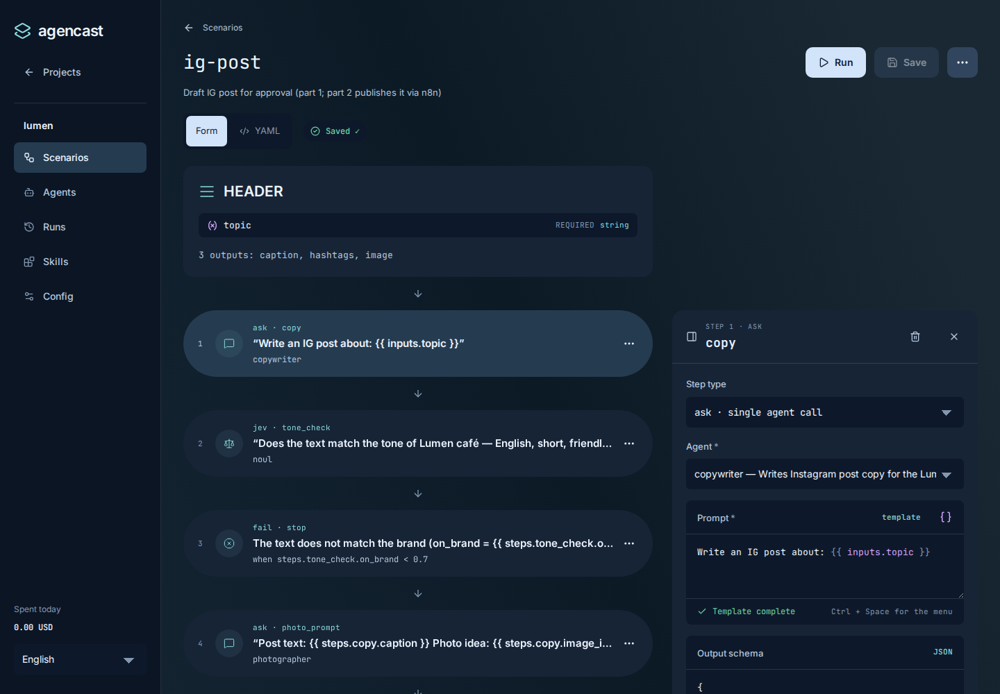

# AgenCast

[](https://github.com/rychidesign/agencast/actions/workflows/ci.yml)

AgenCast is an open-source framework for defining and running LLM-agent workflows. Scenarios use YAML, agents use Markdown, and each run leaves a readable record.

AgenCast is for developers and teams who want to compose repeatable LLM-agent tasks from files that can be read, versioned and reviewed. A scenario describes the flow of work; an agent describes its role and tools.

## Quick start

Tested on Linux/WSL with Python 3.12 and `uv`; native Windows is unsupported, macOS untested.
GUI builds and example MCP servers need Node `^20.19.0 || >=22.12.0` (tested: 24).

```bash
uv tool install "git+https://github.com/rychidesign/agencast#subdirectory=framework"
agencast new project ~/demo --example showcase
cd ~/demo
agencast run ig-post -i topic="coffee" --fake fake/ig-post.yaml
```

This example needs no model key or payment; `--fake` still uses real MCP servers and callbacks.
Offline runs require no `task` steps (including called scenarios) and no `--callback-url`, as above.
The GUI is English by default with a Czech translation. Deploy the GUI only on a private network.
The command above installs the CLI/API; build the GUI from a clone as described below.

## What it does

- Scenarios in YAML, agents and skills in Markdown.
- Ten step types: `ask`, `task`, `jev`, `image`, `parallel`, `switch`, `call`, `set`, `fail` and `output`.
- `task` calls permitted MCP tools; `parallel`, `switch` and `call` compose branches and scenarios.
- A fake provider replaces model calls with no cost and no key; MCP and callbacks stay real.
- Every run stores `summary.md`, `callback.json` and a standalone `report.html`.
- `agencast serve` accepts webhooks and offers a GUI for registered projects.
- Skills for coding agents help both run and create scenarios.



## Installation

Verified on Linux and WSL with Python 3.12; use `uv`.
To build the GUI and run the example MCP server via `npx` you need Node.js
`^20.19.0 || >=22.12.0` (per `ui/package.json`, verified with Node 24).
Native Windows is not supported (`fcntl` in `projects.py` and `task.py`);
macOS is not verified.

From a clone of the repository, including the GUI:

```bash
git clone https://github.com/rychidesign/agencast
cd agencast
(cd ui && npm install && npm run build)   # builds the GUI into the package
uv tool install --editable framework
```

Directly from GitHub without a clone, only the `agencast` command and the server
with the API are installed, without the GUI:

```bash
uv tool install "git+https://github.com/rychidesign/agencast#subdirectory=framework"
```

Examples, tutorials, documentation and skills are bundled even without a clone.

## Getting started

The whole procedure for the package and for a clone: [Getting started with AgenCast](docs/getting-started.md).

`--fake` replaces only model calls: no model cost and no OpenRouter key.
A `task` step still runs the real MCP servers from `mcp.yaml`; the example
`filesystem` uses `npx`, needs Node.js and downloads a package on first run.
`--callback-url` sends a real callback (and needs its signing secret).
Only scenarios without `task` (including called scenarios)
and without `--callback-url` are guaranteed to run offline, for example `ig-post`.

You can run the `ig-post` example from a clone offline (it has no `task`; do not add `--callback-url`):

```bash
agencast --project examples/showcase run ig-post -i topic="new coffee" --fake examples/showcase/fake/ig-post.yaml
```

More examples are in [examples/](examples/). For your own work, create a project, add your OpenRouter key to `.env` and go through the checks without a live call first:

```bash
agencast new project ~/my-project
cd ~/my-project
cp .env.example .env
# Set OPENROUTER_API_KEY in .env.
agencast validate demo
agencast run demo --dry-run
agencast run demo --fake
agencast run demo
```

## Skills for coding agents

`agencast skills install` installs the skills for the Claude Code, Codex,
OpenCode and OMP tools it finds; `--to all` selects all of them. More: [skills/](skills/).

## Repository structure

| Path | Contents |
|---|---|
| `framework/` | Python package and the `agencast` command |
| `ui/` | GUI source code |
| `examples/` | Standalone showcase and tutorial projects |
| `docs/` | Specification, design and tutorials |
| `skills/` | Skills for coding agents |

## Documentation

- [Format specification](docs/spec/)
- [Tutorials](docs/tutorials/)
- [Framework design](docs/DESIGN.md)
- [Framework README](framework/README.md)
- [GUI README](ui/README.md)
- [Skills for coding agents](skills/)

## GUI and server

`agencast serve` can run in project registry mode. On the host, set
`AGENCAST_TOKEN`, `AGENCAST_HOST` and `AGENCAST_PORT` in
`~/.config/agencast/serve.env` (systemd `EnvironmentFile`). Expose the GUI
only on a private network. You can find the address by reading only the host and port:

```bash
grep -E '^AGENCAST_(HOST|PORT)=' ~/.config/agencast/serve.env
```

Never print the token value.

The GUI is English by default. The Czech translation is in `ui/src/locales/cs.json`;
choose the language in the GUI.

## Status and license

The current framework version is **0.17.0** (the 0.17.x line); the history of changes is in
the [changelog](framework/CHANGELOG.md). The project is available under the
[WTFPL version 2](LICENSE) license.

This program comes without any warranty, to the extent permitted by applicable law.

[Contributing](CONTRIBUTING.md) · [Security](SECURITY.md)
